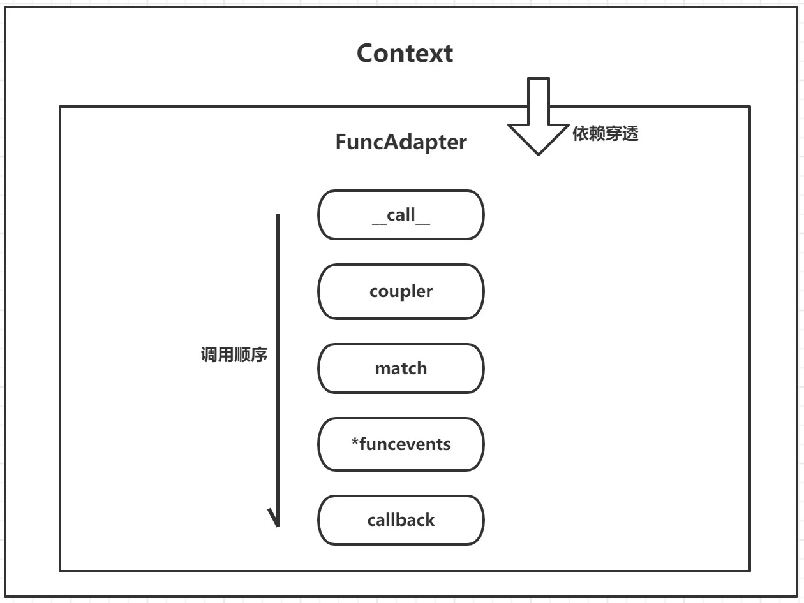

# Similar-Neuron

_A similar-neuron system in Python world._

> 元梦元宙，无极无穷

 
 
 
 

## 入门

* [PEP 484 -- Type Hints](https://www.python.org/dev/peps/pep-0484/)
* [pydantic](https://pydantic-docs.helpmanual.io/)
* [inspect 模块](https://docs.python.org/zh-cn/3.8/library/inspect.html)

## 体系

* [X] FunAdapter
* [X] Granular
* [ ] Listener

## 仿生结构

* 监听器-树突
* 分类器(过滤器)-胞体
* 执行器(调度器)-轴突
* 适配器-突触(末梢)

## FunAdapter

*为了平滑适配接口，提供一个易于解耦的通用适配器，为函数提供一致性的栈空间*
**特性**

* 依赖注入
* 依赖穿透
* 支持async/await

### Adapter

**`Adapter` 是一个事件簇的抽象，根据其依赖的上下文创造出一种调用方式**

* `coupler` 协议转换栈(可选)
* `match` 事件匹配栈(可选)
* `funcevnets` 函数事件簇栈(必须)
* `callback` 回调事件栈(可选)

**exmaple**: [AdapterEvent](src/test/test3-AdapterEvent.py)

### FramePenetration

**`FramePenetration` 是一个自动依赖注入的上下文**

**exmaple**: [FramePenetration](src/test/test1-FramePenetration.py)

## Granular

*根据**实体**和**约束**进行完备粒度控制，100%控制所有终端实体*

**`Granular` 是 `SimilarNeuron` 的核心，为贯彻古今未来，将宇宙悉数辉映的重要基石，它魅力无限！**
